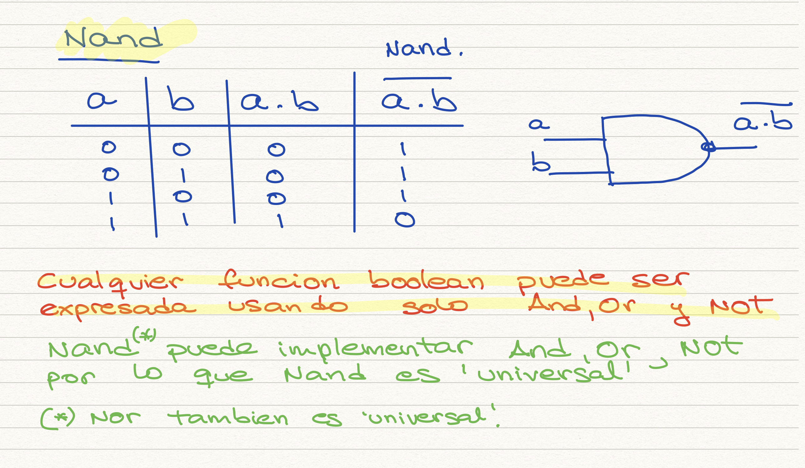
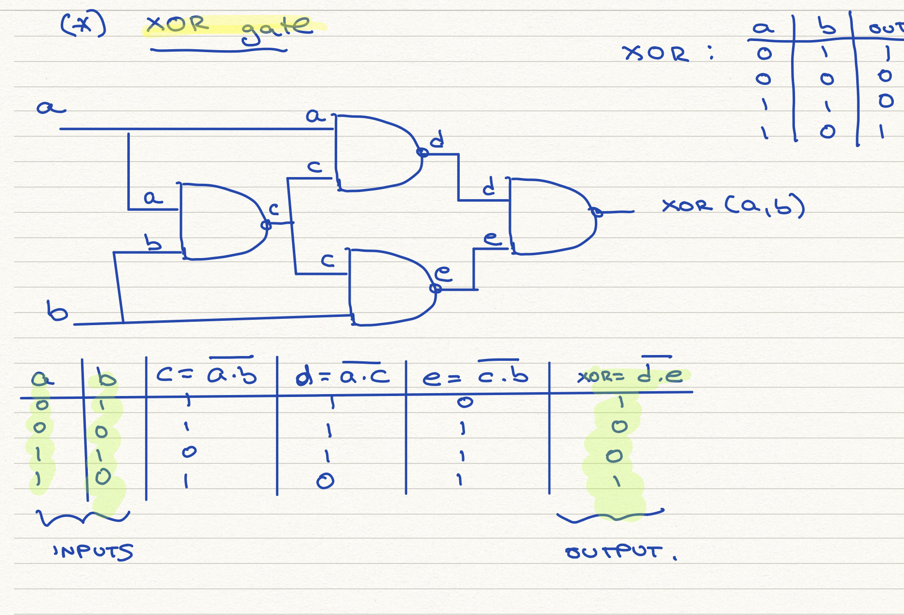
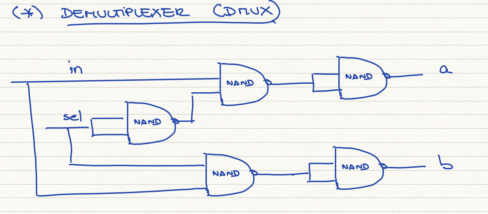
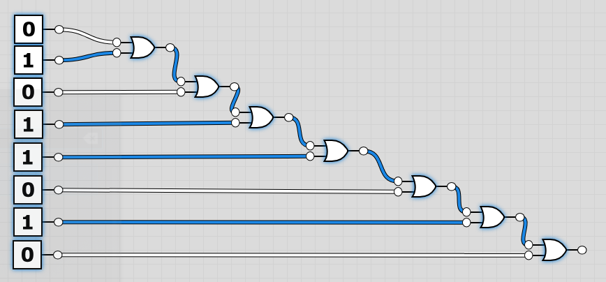
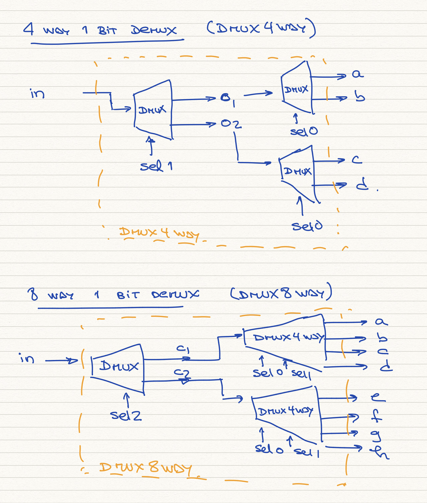

# Logical Gates - Implementation Notes


*Every Boolean function* can be expressed using three Boolean operators only: *And*, *Or* and *Not*

Now, if we can implement "And","Or" and "Not" using a logical gate, then this logical gate is "universal". Well, it turns out that "Nand" and "Nor" gates are universal.

## Building NOT, OR and AND from NAND gates:


## Building a XOR gate
The XOR function returns 1 when its 2 inputs have opposing values, otherwise returns 0.
This can be built with 4 Nand gates.



## Building a Multiplexor (Mux)
This is a three-input gate that uses one of its inputs , called "selection bit", to select and outputs one of the other two inputs called "data bits".

This can be summarized as:

```
    if sel = 0 :
        out=a
    else:
        out=b
```


## Building a Demultiplexor (DMux)
This performs the opposite function of a Mux. It takes a single input and channels it to one of 2 possible outputs according to a selector bit that specifies which output to choose.

we can build a DMux using 5 Nand gates:



## Building a Multi-Bit Not (Not16)
Computer hardware is typically designed to operate on multi-bit arrays called "buses". Here we will design a 16-bit computer.

To design a 16-bit Not we need to pass a 16 bit input bus to an array of 16 binary Not gates (or 16 Nand(a,a) gates). The output will be a 16 bit output bus.
Note that the process is identical for 32-bit or 64-bit computers.

```
CHIP Not16 {
    IN in[16];
    OUT out[16];

    PARTS:
    Not(in=in[0],out=out[0]);
    Not(in=in[1],out=out[1]);
    Not(in=in[2],out=out[2]);
    Not(in=in[3],out=out[3]);
    Not(in=in[4],out=out[4]);
    Not(in=in[5],out=out[5]);
    Not(in=in[6],out=out[6]);
    Not(in=in[7],out=out[7]);
    Not(in=in[8],out=out[8]);
    Not(in=in[9],out=out[9]);
    Not(in=in[10],out=out[10]);
    Not(in=in[11],out=out[11]);
    Not(in=in[12],out=out[12]);
    Not(in=in[13],out=out[13]);
    Not(in=in[14],out=out[14]);
    Not(in=in[15],out=out[15]);
}
```


The output is:

|        in        |       out        |
|:----------------:|:----------------:|
| 0000000000000000 | 1111111111111111 |
| 1111111111111111 | 0000000000000000 |
| 1010101010101010 | 0101010101010101 |
| 0011110011000011 | 1100001100111100 |
| 0001001000110100 | 1110110111001011 |

## Building a Multi-Bit And and Or (And16 and Or16)

Here we require 2 16-bit input buses, 16 binary AND (or OR gates) gates and 1 16-bit output bus.

The process is similar to the Not gate.

```
CHIP Or16 {
    IN a[16], b[16];
    OUT out[16];

    PARTS:
    Or(a=a[0], b=b[0],out=out[0]);
    Or(a=a[1], b=b[1],out=out[1]);
    Or(a=a[2], b=b[2],out=out[2]);
    Or(a=a[3], b=b[3],out=out[3]);
    Or(a=a[4], b=b[4],out=out[4]);
    Or(a=a[5], b=b[5],out=out[5]);
    Or(a=a[6], b=b[6],out=out[6]);
    Or(a=a[7], b=b[7],out=out[7]);
    Or(a=a[8], b=b[8],out=out[8]);
    Or(a=a[9], b=b[9],out=out[9]);
    Or(a=a[10], b=b[10],out=out[10]);
    Or(a=a[11], b=b[11],out=out[11]);
    Or(a=a[12], b=b[12],out=out[12]);
    Or(a=a[13], b=b[13],out=out[13]);
    Or(a=a[14], b=b[14],out=out[14]);
    Or(a=a[15], b=b[15],out=out[15]);

}
```

## Multi-Bit Multiplexor (Mux16)

Note that this time we need 3 inputs per bit (a,b,selector)
```
CHIP Mux16 {
    IN a[16], b[16], sel;
    OUT out[16];

    PARTS:
    Mux(a=a[0],b=b[0],sel=sel,out=out[0]);
	Mux(a=a[1],b=b[1],sel=sel,out=out[1]);
	Mux(a=a[2],b=b[2],sel=sel,out=out[2]);
	Mux(a=a[3],b=b[3],sel=sel,out=out[3]);
	Mux(a=a[4],b=b[4],sel=sel,out=out[4]);
	Mux(a=a[5],b=b[5],sel=sel,out=out[5]);
	Mux(a=a[6],b=b[6],sel=sel,out=out[6]);
	Mux(a=a[7],b=b[7],sel=sel,out=out[7]);
	Mux(a=a[8],b=b[8],sel=sel,out=out[8]);
	Mux(a=a[9],b=b[9],sel=sel,out=out[9]);
	Mux(a=a[10],b=b[10],sel=sel,out=out[10]);
	Mux(a=a[11],b=b[11],sel=sel,out=out[11]);
	Mux(a=a[12],b=b[12],sel=sel,out=out[12]);
	Mux(a=a[13],b=b[13],sel=sel,out=out[13]);
	Mux(a=a[14],b=b[14],sel=sel,out=out[14]);
	Mux(a=a[15],b=b[15],sel=sel,out=out[15]);
}
```

## Multi-Way Or (Or8Way)

This chip outputs 1 when at least one of its 8 bits inputs 1, and 0 otherwise.

|     in     | out |
|:----------------:|:----------------:|
|  00000000  |  0  |
|  11111111  |  1  |
|  00010000  |  1  |
|  00000001  |  1  |
|  00100110  |  1  |





## Multi-way/Multi-Bit Multiplexor


### 4 way 16 bit Mux (Mux4Way16)
Selects one of the 4 16-bits input buses and outputs it into a single 16-bit output bus.

### 8 way 16 bit Mux (Mux8Way16)
Selects one of the 8 16-bits input buses and outputs it into a single 16-bit output bus.


## Multi-way/Multi-bit Demultiplexor

### 4 way 1-bit Demux (DMux4Way)
Channels a single 16-bit input into one of 4 possible 16-bit outputs
### 8-way 1-bit Demux (DMux8Way)
Channels a single 16-bit input into one of 8 possible 16-bit outputs
