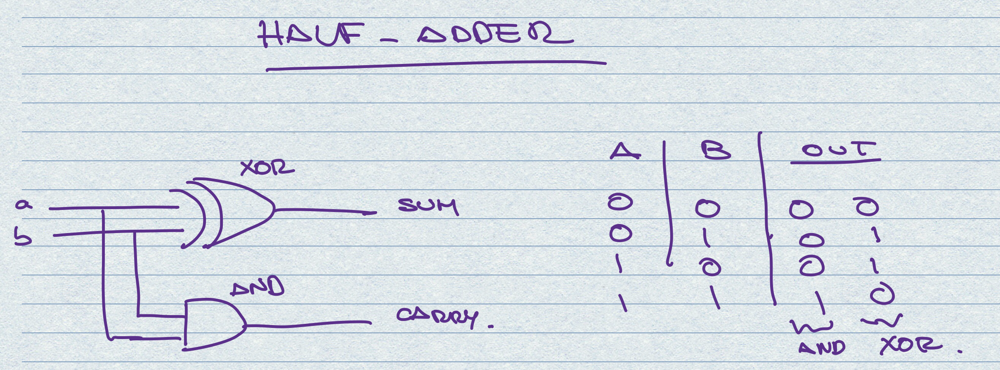

# Implementation Notes - Chapter 2.

## De Morgan's Law

```
NOT(A+B) = NOT(A).NOT(B)   or   NOT(A OR B) = NOT(A) AND NOT(B)

NOT(A.B) = NOT(A)+NOT(B)   or   NOT(A AND B) = NOT(A) OR NOT(B)
```


## Half Adder

This circuit uses and XOR for the sum and an AND for the carry bit.

This circuit is not able to handle operations like 1+1+(carry 1). For that we need a full adder.

Note that in the Half Adder the sum is given by the XOR and the carry is given by the AND.

```
|   a   |   b   |  sum  | carry |
|   0   |   0   |   0   |   0   |
|   0   |   1   |   1   |   0   |
|   1   |   0   |   1   |   0   |
|   1   |   1   |   0   |   1   |


```
## Full Adder
This circuit is built with 2 Half adders and 1 OR gate.

We use the sum output of the 1st Half Adder (XOR) and the Carry In as inputs for the 2nd Half Adder. The output of this will be the sum (XOR).

For the carry out bit, we combine the carry bit of the first Half adder with the carry bit of the 2nd half adder.


```
|   a   |   b   |   c   |  sum  | carry |
|   0   |   0   |   0   |   0   |   0   |
|   0   |   0   |   1   |   1   |   0   |
|   0   |   1   |   0   |   1   |   0   |
|   0   |   1   |   1   |   0   |   1   |
|   1   |   0   |   0   |   1   |   0   |
|   1   |   0   |   1   |   0   |   1   |
|   1   |   1   |   0   |   0   |   1   |
|   1   |   1   |   1   |   1   |   1   |
```

## Add16

This circuit is built with a combination of half adder to add the least significant bit and a series of full adders to take the carry bits during the operation.
The most significant bit is discarded so the operation always returns a 16-bit number.

```
|        a         |        b         |       out        |
| 0000000000000000 | 0000000000000000 | 0000000000000000 |
| 0000000000000000 | 1111111111111111 | 1111111111111111 |
| 1111111111111111 | 1111111111111111 | 1111111111111110 |
| 1010101010101010 | 0101010101010101 | 1111111111111111 |
| 0011110011000011 | 0000111111110000 | 0100110010110011 |
| 0001001000110100 | 1001100001110110 | 1010101010101010 |
```

## Inc16

Add 1 to a 16 bit input.

```
|        in        |       out        |
| 0000000000000000 | 0000000000000001 |
| 1111111111111111 | 0000000000000000 |
| 0000000000000101 | 0000000000000110 |
| 1111111111111011 | 1111111111111100 |
```
